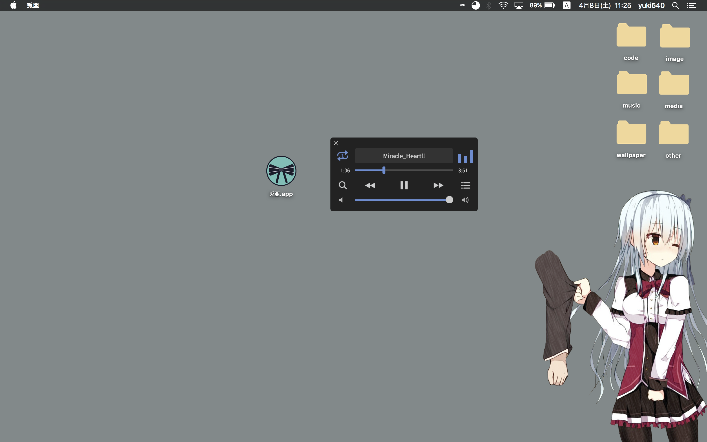
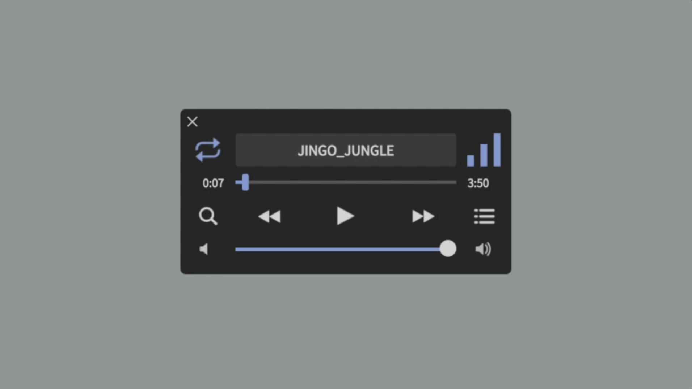
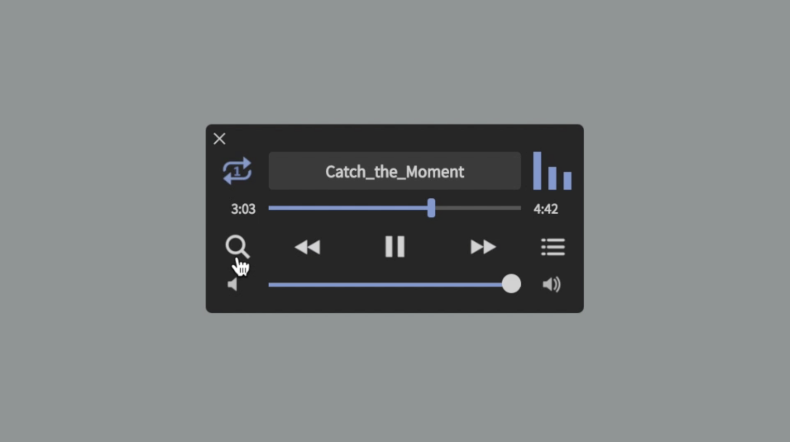
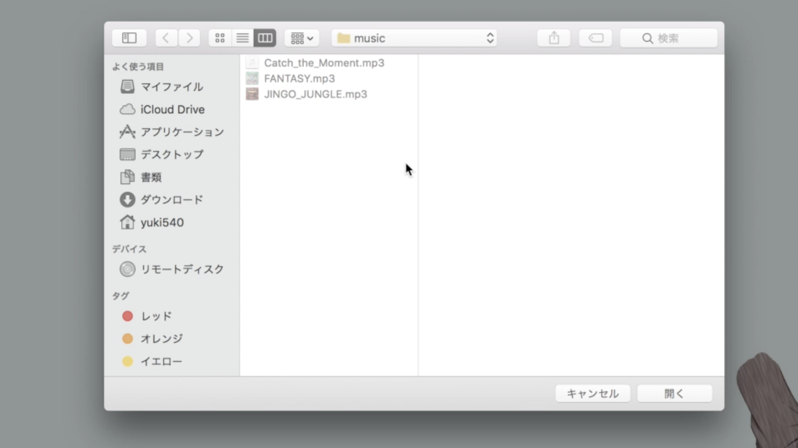
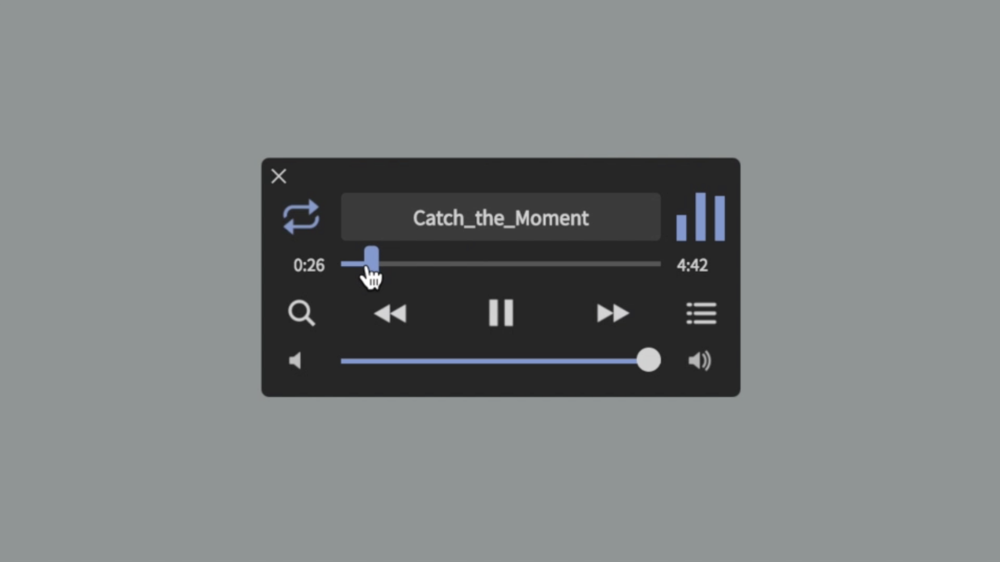
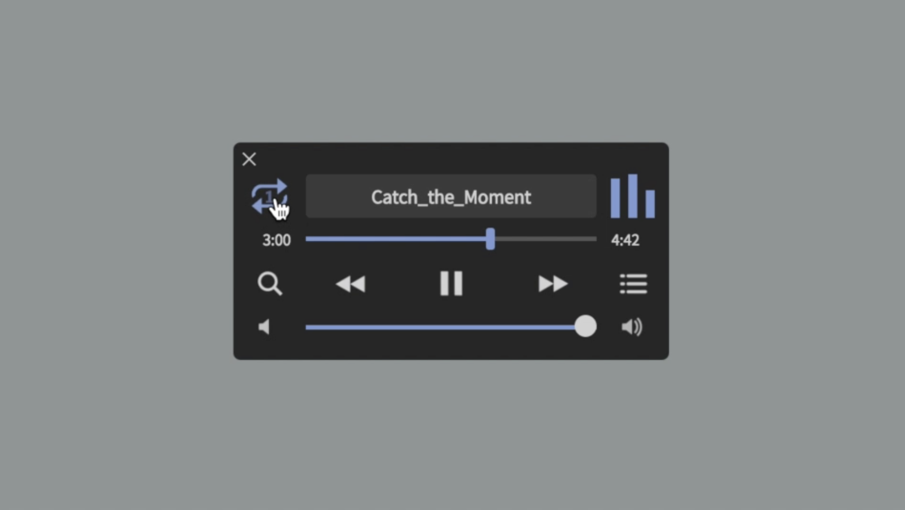
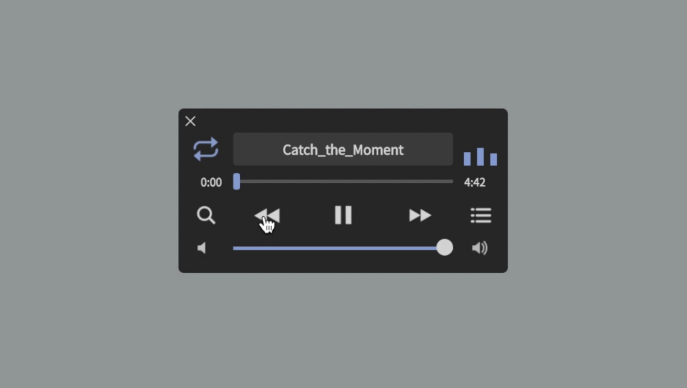
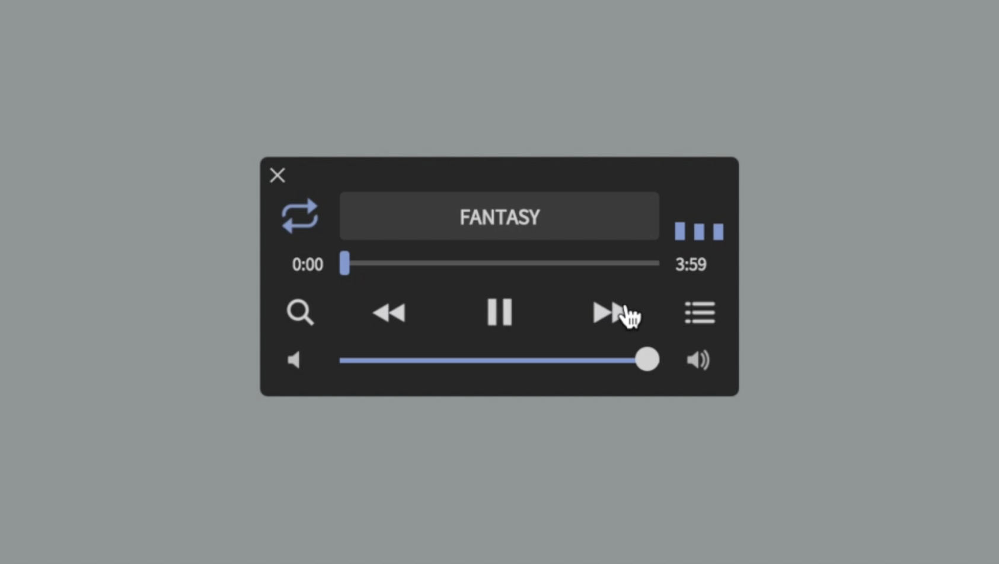
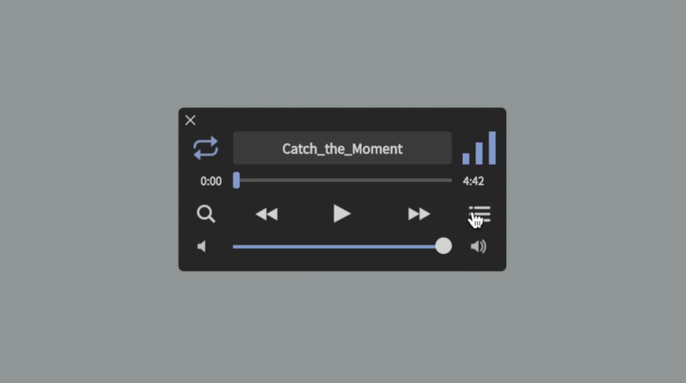
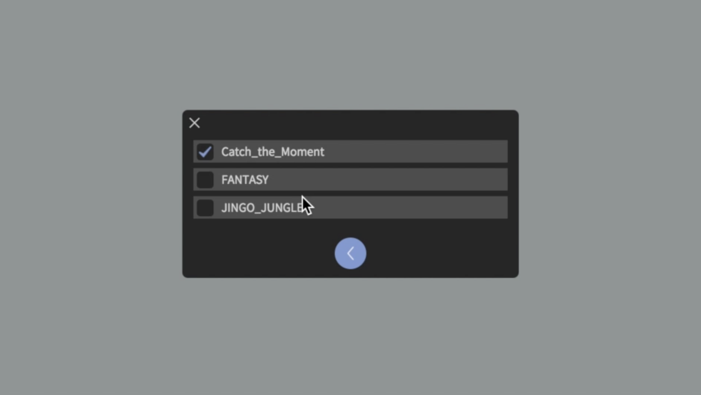

# 兎亜 - toa
「兎亜」は、Electron製のシンプルなミュージックプレイヤーです。

選択したディレクトリ内のmp3ファイルを再生するという、シンプルな設計のソフトウェアです。

コンパクトなウィンドウサイズなので、デスクトップでの作業スペースを奪うことなく配置できます。

また、フラットで美しいデザインに仕上げました。

## Demo
動作を確認したい場合は、
[https://twitter.com/eriri_jp/status/850557992990687232](https://twitter.com/eriri_jp/status/850557992990687232)
をみてください。

「兎亜」に関することは、
[http://qiita.com/yuki540/items/8a2b8b07bea896fb7151](http://qiita.com/yuki540/items/8a2b8b07bea896fb7151)
をみてください。

## Download
「兎亜」を使いたい場合は、
[https://github.com/yuki540net/toa/releases/tag/v0.0.1](https://github.com/yuki540net/toa/releases/tag/v0.0.1)
で自身のOSにあったものをダウンロードしてください。

Mac/Windows/Linuxに対応しています。

## Usage
まず、「兎亜」を起動してください。

### ディレクトリを選択
検索のアイコンのボタンを押すと、

ディレクトリの選択画面が出るので、mp3ファイルの入ったディレクトリを選択してください。

すると、ディレクトリの音楽が操作可能になります。

### 再生位置の移動
シークバーを移動させると、再生位置が調整できます。

### リピート
曲名の左のアイコンを押すと、全曲リピートと一曲リピートに切り替えられます。

### 曲のスキップ
再生ボタンの左のアイコンを押すと、前の曲に戻ります。

再生ボタンの右のアイコンを押すと、次の曲に進みます。

### 曲の選択
リストのようなアイコンを押すと、

曲の一覧に移動します。
変更したい曲のチェックボックスを押すと、曲を変更することができます。

## Lisence
このソフトウェアは、MIT Lisenceのもとで公開されています。